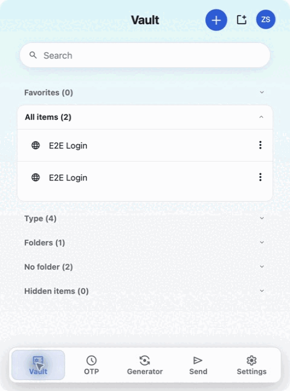
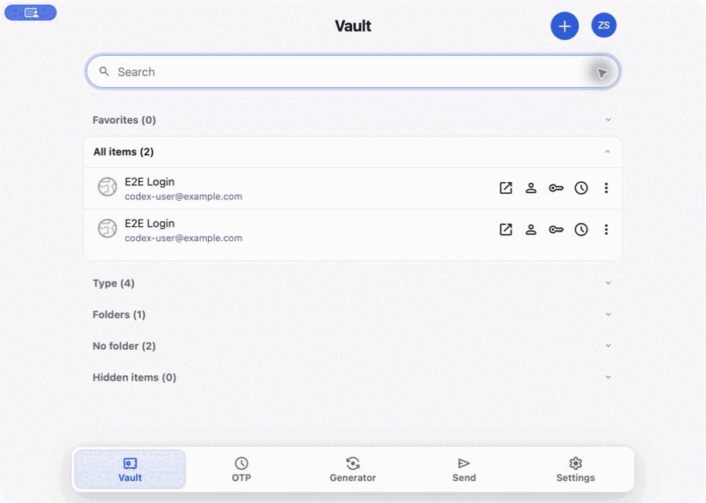

# Barwarden

<p align="center">
  
</p>

<p align="center">
  Fast access to your Bitwarden-compatible vault, right from the macOS menu bar.
</p>

<p align="center">
  <a href="README.md">中文</a> · English
</p>

## The core experience: the menu bar

Barwarden stays in the menu bar, so you can search your vault, use a credential,
or open the generator without switching to a full desktop app.

<p align="center">
  
</p>

When you need more room, the same view can pop out into a standalone window
without losing its current state.

<details>
<summary>View standalone-window mode</summary>

<p align="center">
  
</p>

</details>

## Server compatibility

Barwarden is a client and does not include a server. You can connect it to:

- The official [Bitwarden](https://bitwarden.com/) cloud service (US/EU), or a
  self-hosted [Bitwarden Server](https://github.com/bitwarden/server).
- A self-hosted [Vaultwarden](https://github.com/dani-garcia/vaultwarden)
  instance, a community-maintained implementation compatible with the Bitwarden
  API.

Self-hosted services must use HTTPS. Actual compatibility depends on the
server's API implementation.

## Highlights

- Stay in the menu bar and quickly open your vault, search items, and use the
  field you need.
- Sign in, unlock, lock, sign out, and synchronize a vault.
- Browse and manage personal vault items; quickly copy or paste a field.
- Generate passwords, passphrases, and usernames.
- Use Text Send, PIN unlock, and Touch ID unlock where macOS supports it.
- Switch to a standalone window when you need a larger workspace.
- Check for and install signature-verified updates from About.

## Install

1. Download a DMG from [Releases](../../releases).
2. Open it and drag `Barwarden.app` to Applications.
3. Launch Barwarden; it remains available from the macOS menu bar.

Use only packages published by this repository. Check the corresponding Release
for its Developer ID signing and Apple notarization status.

## Supported scope

| Item | Current support |
| --- | --- |
| System | macOS 13.0 (Ventura) or later |
| Services | Bitwarden cloud or self-hosted, Vaultwarden |
| Vault | Personal logins, cards, identities, and secure notes |
| Distribution | GitHub Releases DMG and in-app updates |

Browser autofill, attachments, File Send, SSO, import/export, organization
management, and passkeys are not currently supported. Compatibility with
third-party servers depends on their API implementation.

## Local development

Requires macOS 13+, Node.js 22+, npm, Rust stable, and Xcode Command Line Tools.

```bash
npm ci
npm run tauri:dev
```

Build a DMG:

```bash
npm run tauri:build
```

Common checks:

```bash
npm run test:brand
npm test
npm run build:web
npm run check:publication
```

Build output is written to `apps/menubar-tauri/src-tauri/target/release/bundle/`
and must not be committed.

## Documentation

- [Contributing](CONTRIBUTING.md)
- [Privacy](PRIVACY.md)
- [Security reporting](SECURITY.md)
- [License](LICENSE)
- [Upstream and copyright notices](NOTICE.md)
- [Third-party open-source components](THIRD_PARTY_NOTICES.md)

Barwarden is an independent open-source project. It is not an official
Bitwarden product and is not affiliated with Bitwarden, Inc. Bitwarden-related
trademarks belong to their respective owners; see [NOTICE.md](NOTICE.md).
