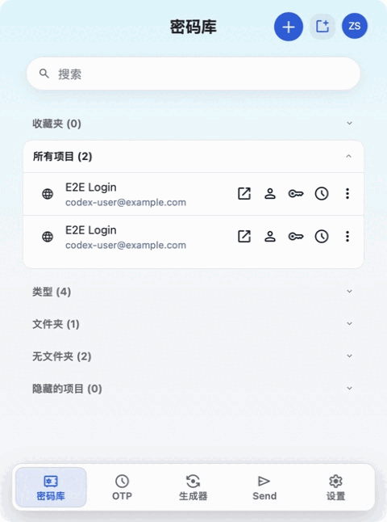
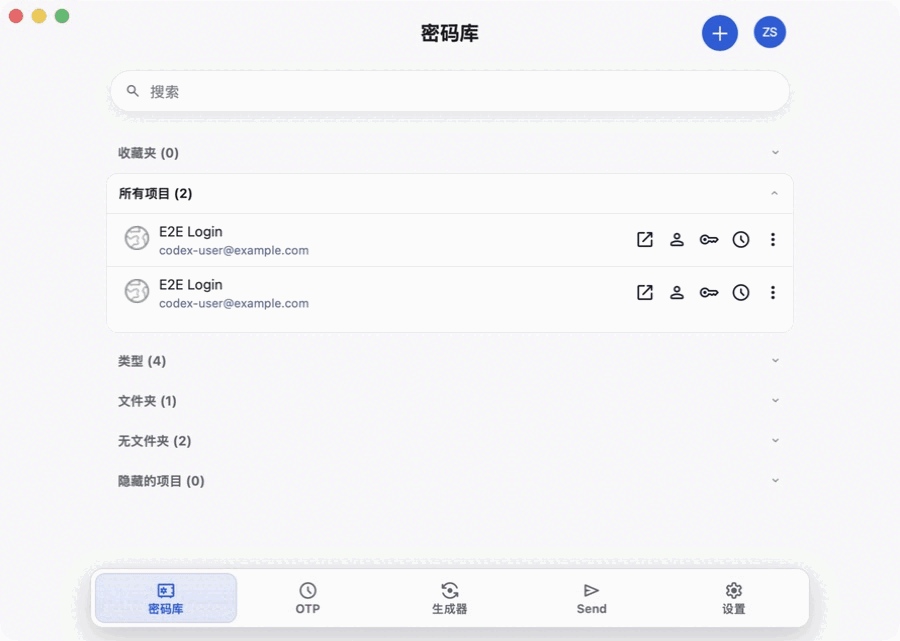

# Barwarden

<p align="center">
  
</p>

<p align="center">
  把密码库放进 macOS 菜单栏，随用随开，兼容 Bitwarden® 服务。
</p>

<p align="center">
  中文 · <a href="README.en.md">English</a>
</p>

## 核心体验：菜单栏

Barwarden 常驻菜单栏，无需切换到完整桌面应用，即可快速搜索保险库、复制凭据或打开
生成器。

<p align="center">
  
</p>

需要更多空间时，可以一键弹出独立窗口，功能和当前状态保持一致。

<details>
<summary>查看独立窗口模式</summary>

<p align="center">
  
</p>

</details>

## 服务端兼容性

Barwarden 是客户端，不包含服务端。你可以连接：

- [Bitwarden](https://bitwarden.com/) 官方云服务（US/EU），或自行部署
  [Bitwarden Server](https://github.com/bitwarden/server)。
- 自行部署的 [Vaultwarden](https://github.com/dani-garcia/vaultwarden)，这是社区维护的
  Bitwarden API 兼容服务端。

自托管服务必须使用 HTTPS；实际兼容性取决于服务端的 API 实现。

## 主要功能

- 常驻菜单栏，快速唤出保险库、搜索条目并使用所需字段。
- 登录、解锁、锁定、退出和保险库同步。
- 浏览和管理个人保险库条目，快速复制或粘贴所需字段。
- 生成密码、通行短语和用户名。
- 使用文本 Send、PIN 解锁，以及 macOS 支持时的 Touch ID 解锁。
- 需要更大工作区时切换到独立窗口。
- 从“关于”页面检查并安装经过签名校验的更新。

## 安装

1. 从 [Releases](../../releases) 下载 DMG。
2. 打开 DMG，将 `Barwarden.app` 拖入“应用程序”。
3. 启动 Barwarden；应用会驻留在 macOS 菜单栏。

请只使用本仓库发布的安装包。签名与 Apple 公证状态以对应 Release 的说明为准。

## 支持范围

| 项目 | 当前支持 |
| --- | --- |
| 系统 | macOS 13.0（Ventura）及更高版本 |
| 服务 | Bitwarden 云服务或自托管、Vaultwarden |
| 保险库 | 个人登录、卡片、身份和安全笔记 |
| 分发 | GitHub Releases DMG、应用内更新 |

当前不支持浏览器自动填充、附件、文件 Send、SSO、导入/导出、组织管理和通行密钥。
第三方服务端的兼容性取决于其 API 实现。

## 本地开发

需要 macOS 13+、Node.js 22+、npm、Rust stable 和 Xcode Command Line Tools。

```bash
npm ci
npm run tauri:dev
```

构建 DMG：

```bash
npm run tauri:build
```

常用检查：

```bash
npm run test:brand
npm test
npm run build:web
npm run check:publication
```

构建输出位于 `apps/menubar-tauri/src-tauri/target/release/bundle/`，请勿提交。

## 文档

- [参与开发](CONTRIBUTING.md)
- [隐私说明](PRIVACY.md)
- [安全漏洞报告](SECURITY.md)
- [许可证](LICENSE)
- [上游与版权声明](NOTICE.md)
- [第三方开源组件](THIRD_PARTY_NOTICES.md)

Barwarden 是独立开源项目，不是 Bitwarden 官方产品，也不隶属于 Bitwarden, Inc.。
Bitwarden 相关商标归其各自权利人所有，详见 [NOTICE.md](NOTICE.md)。
