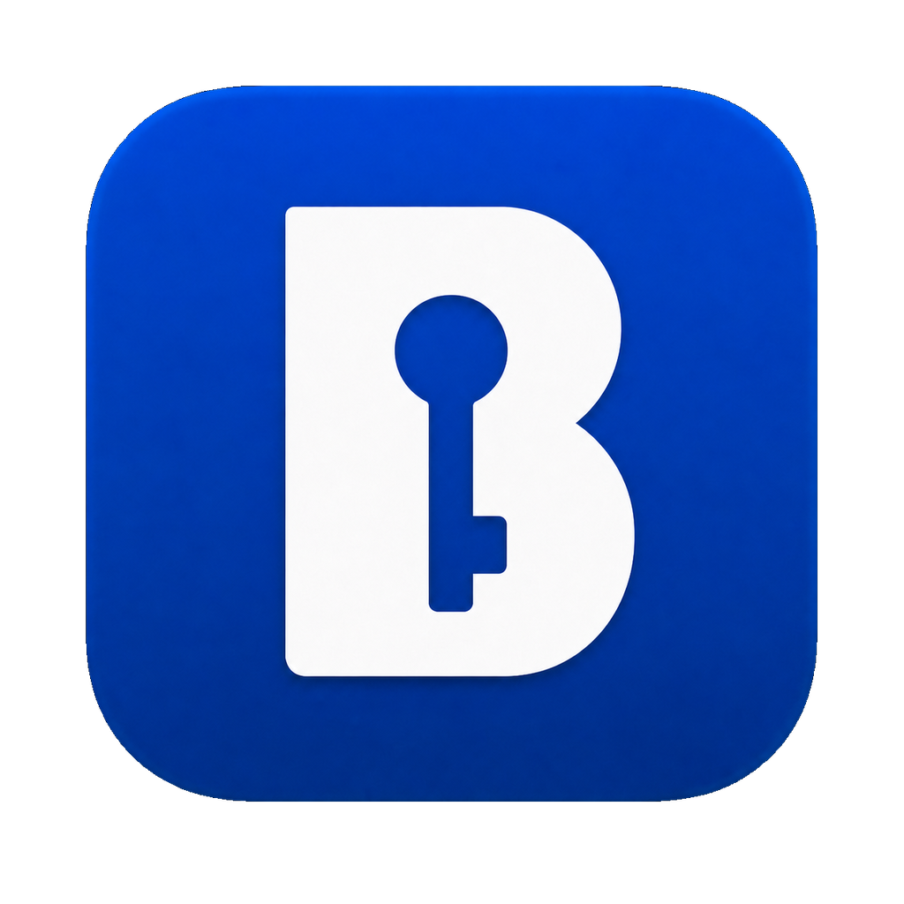
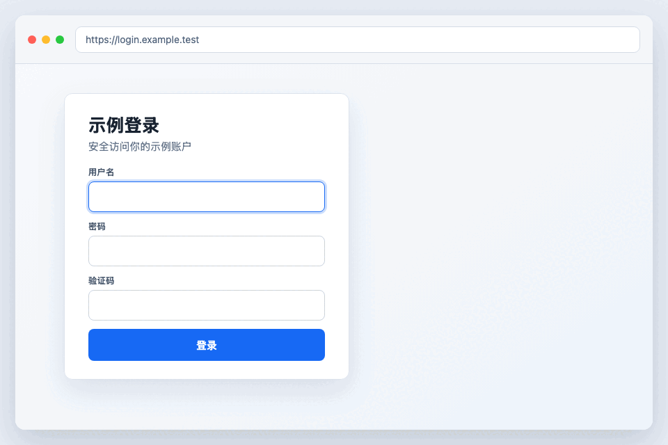
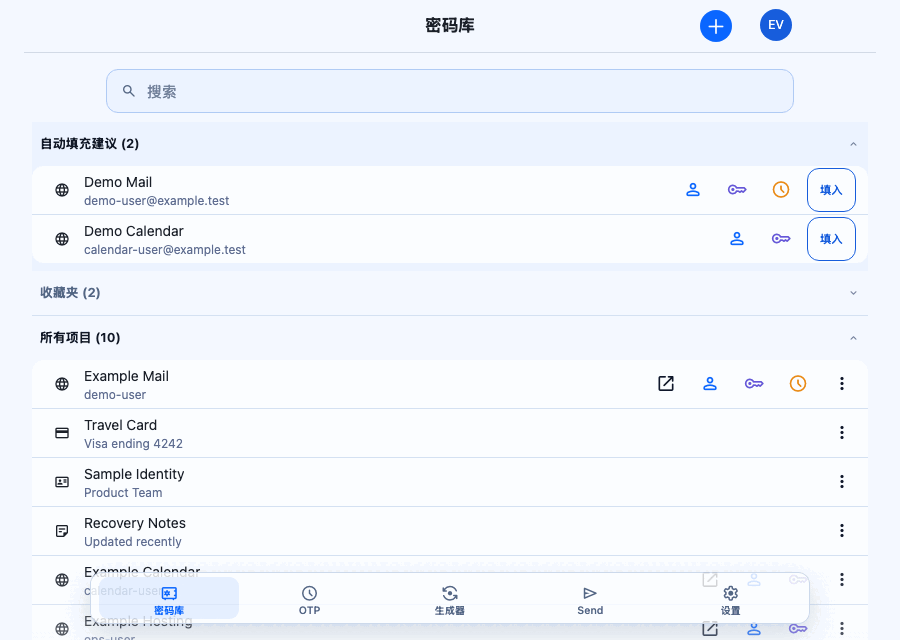

# Barwarden

  

  把密码库放进 macOS 菜单栏，随用随开，兼容 Bitwarden® 服务。

  中文 · <a href="README.en.md">English</a>

## 核心体验：菜单栏

Barwarden 常驻菜单栏，无需切换到完整桌面应用，即可快速搜索保险库、复制凭据或打开
生成器。

  

需要更多空间时，可以一键弹出独立窗口，功能和当前状态保持一致。

查看独立窗口模式

  

## 服务端兼容性

Barwarden 是客户端，不包含服务端。你可以连接：

- [Bitwarden](https://bitwarden.com/) 官方云服务（US/EU），或自行部署
  [Bitwarden Server](https://github.com/bitwarden/server)。
- 自行部署的 [Vaultwarden](https://github.com/dani-garcia/vaultwarden)，这是社区维护的
  Bitwarden API 兼容服务端。

自托管服务必须使用 HTTPS；实际兼容性取决于服务端的 API 实现。

## 主要功能

- 常驻菜单栏，快速唤出保险库、搜索条目并使用所需字段。
- 根据当前应用和域名提供自动填充建议，并将用户名、密码或验证码填入先前聚焦的
  输入区域。
- 支持 macOS 系统密码自动填充、输入框建议图标，以及复制或复制并粘贴两种填充模式。
- 登录、解锁、锁定、退出和保险库同步。
- 浏览和管理个人保险库条目，快速复制或粘贴所需字段。
- 生成密码、通行短语和用户名。
- 使用文本 Send、PIN 解锁，以及 macOS 支持时的 Touch ID 解锁。
- 需要更大工作区时切换到独立窗口。
- 从“关于”页面检查并安装经过签名校验的更新。

## 安装

1. 从 [Releases](../../releases) 下载 DMG。
2. 打开 DMG，将 `Barwarden.app` 拖入“应用程序”。
3. 启动 Barwarden；应用会驻留在 macOS 菜单栏。

请只使用本仓库发布的安装包。签名与 Apple 公证状态以对应 Release 的说明为准。

## 首次设置

1. 登录 Bitwarden 兼容服务；使用自托管服务时，先在登录页面设置 HTTPS 服务地址。
2. 在 Barwarden 的“设置 > 填充”中选择复制模式，并按需开启输入框建议图标。
3. 需要识别当前应用、域名或先前聚焦的输入区域时，按应用内提示在“系统设置 >
   隐私与安全性 > 辅助功能”中允许 Barwarden。
4. 需要使用系统密码自动填充时，在当前 macOS 版本的密码或自动填充设置中启用
   Barwarden。不同 macOS 版本的设置入口名称可能不同。
5. 如果应用提示后台自动填充服务需要处理，请前往“系统设置 > 通用 > 登录项”允许
   Barwarden AutoFill，然后重试。
6. 可在“设置 > 快捷键”中录制或清除唤出 Barwarden 的全局快捷键。

辅助功能权限用于识别当前应用和输入区域，并把已选择的字段填入先前聚焦的位置。

## 文档

- [参与开发](CONTRIBUTING.md)
- [隐私说明](PRIVACY.md)
- [许可证](LICENSE)
- [上游与版权声明](NOTICE.md)
- [第三方开源组件](THIRD_PARTY_NOTICES.md)

Barwarden 是独立开源项目，不是 Bitwarden 官方产品，也不隶属于 Bitwarden, Inc.。
Bitwarden 相关商标归其各自权利人所有，详见 [NOTICE.md](NOTICE.md)。
